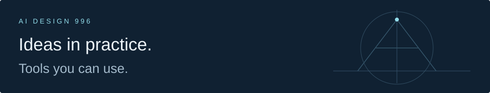

[English](https://aidesign996.github.io/ai-practice/) · [繁體中文](https://aidesign996.github.io/ai-practice/index.zh-hant.html) · [简体中文](https://aidesign996.github.io/ai-practice/index.zh.html)

我製作可以複用的 AI 技能，也分享背後的設計思考。

**[瀏覽文章與技能 →](https://aidesign996.github.io/ai-practice/index.zh-hant.html)**

## 最新文章

[為什麼我給 AI 項目配了一位負責人](https://aidesign996.github.io/ai-practice/article-team-leader.zh-hant.html) 
看方向、協調配合，讓經驗幫助下一次判斷。

## 精選技能

[Team Leader](https://github.com/aidesign996/team-leader/blob/main/README.zh-Hant.md) · Astra · v0.5.24 · MIT 
持續看目標、協調配合，帶著經驗做事。

[安裝 / 更新](https://github.com/aidesign996/team-leader/blob/main/README.zh-Hant.md#start) · [版本記錄](https://github.com/aidesign996/team-leader/blob/main/CHANGELOG.md)

---

[帶來你的真實場景或建議](https://aidesign996.github.io/ai-practice/article-team-leader.zh-hant.html#comments)。三種語言版本共享同一個公開討論區。
